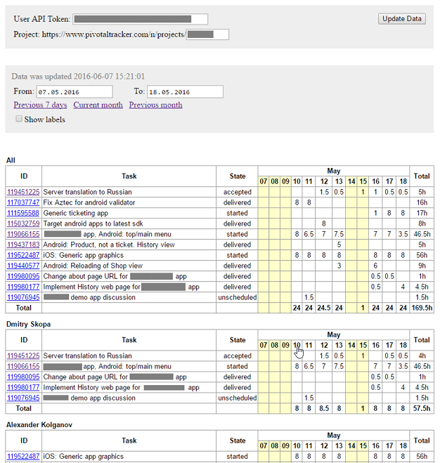

# timetracking-4-pivotal

This utility is a standalone html-page that fetches all stories from a Pivotal Tracker project and iterate over each story comment to find time spent records. Then it builds a spreadsheet with a summarized data.

## How to use

1. get this repository to your computer
2. open `pivotal-report.html` file in your browser (Chrome, Firefox)
3. fill User API Token (you can find it in your [profile page](https://www.pivotaltracker.com/profile) on the Pivotal site) and Project id
4. press Update Data button and see the result
5. tweak report dates, etc.

## Recognized `spent` comment patterns

Any story comment is considered to be a time spent record if it starts with one of the following patterns:

### Short record
`spent 2h`

Tells that 2 hours were spent by commenter for the story in the same day as the comment was added.

### Record for a certain date
`2016-03-29 spent 2h`

Tells that 2 hours were spent by commenter for the story in the given date

### Record with other time units
`spent 30m`

The same as `spent 0.5h`. Also `d` is supported (for whatever reason).

### Record with an explaination comment
`spent 1.5h: reading the spec`

Actually any stuff after time value is just ignored.